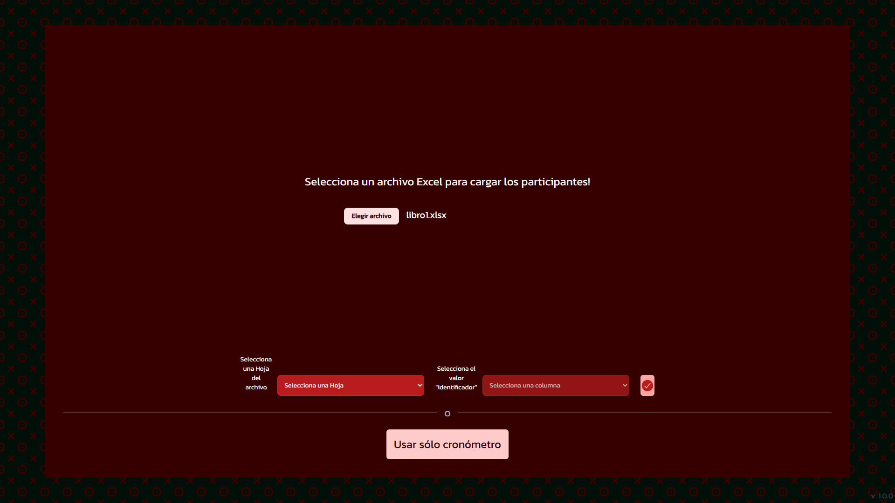
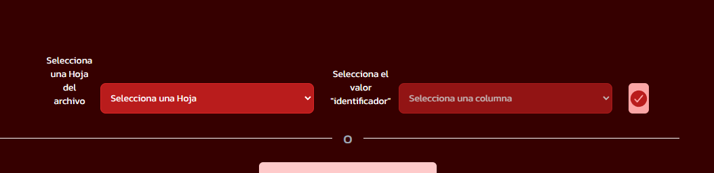
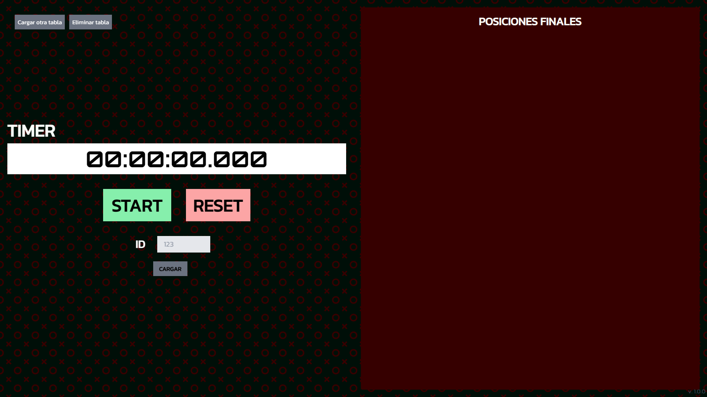
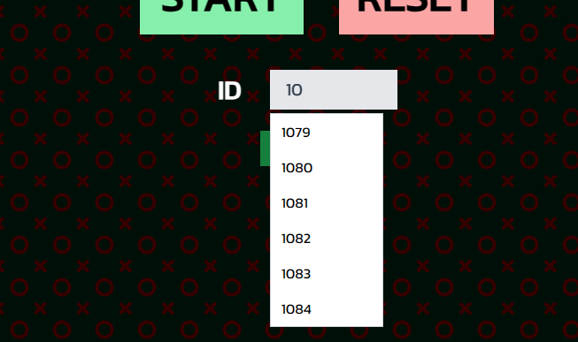
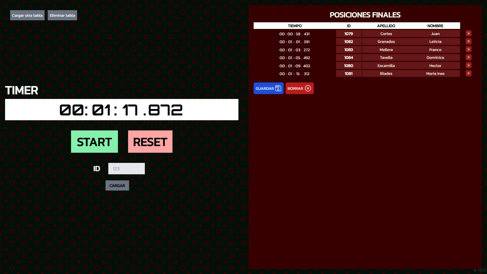
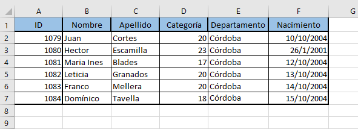
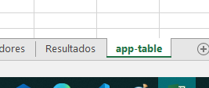
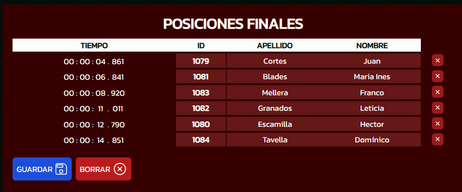
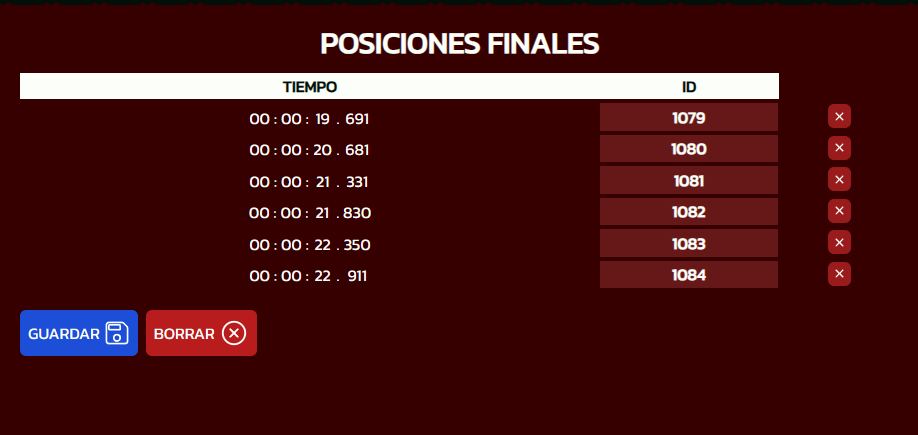

# Marathon App


## Manual para el usuario

Esta aplicación sirve para determinar el tiempo y el orden de finalización de los corredores en una carrera.

1. Carga el archivo Excel que tenga la lista de los participantes:
<br>

###### [(Ver formato ideal del archivo)](#formato-de-archivo-excel-recomendado)
<div align="center">
  
</div>
También tienes la posibilidad de no utilizar las tablas, y usar solamente el cronómetro.
<br><br>


2. Una vez seleccionado el archivo, debes seleccionar 2 cosas:
  - La hoja del archivo en la que se encuentra la tabla.
  - El "valor identificador". Que básicamente es la columna del dato que vas a utilizar para ir ingresando los finalistas. Como por ejemplo: id, clave, dni, etc. Incluso puedes hacerlo por apellido, si la tabla posee este dato.
<div align="center">
  
</div>
<br><br>

3. Con la tabla cargada, ahora puedes darle inicio al cronómetro y empezar a registrar los tiempos.
En la imagen puedes ver que, a modo de ejemplo, se va a utilizar la clave "id", para encontrar los participantes en el buscador.
<div align="center">
  
</div>
Una vez que comienzas a escribir en el cuadro de búsqueda, te empezaran a salir las opciones posibles. Tienes dos maneras de seleccionarlas: clickeando en la opción, o apretando enter. Si aprietas Enter se registrará el primer elemento elemento de la lista (en este caso "1079"):
<div align="center">
  
</div>

4. Una vez recolectados los datos, puedes guardar la tabla como un archivo excel:
<div align="center">
  
</div>

<br>
<br>

Para entender aún más el funcionamiento, puedes utilizar un archivo de ejemplo que se encuentra en ['/public/sample-file'](https://github.com/HernanArevalo/marathon-app/tree/main/public/sample-file)


### Formato de archivo Excel recomendado:
  1. Intentá que en la hoja donde tengas la tabla, solo esté la tabla que vayas a utilizar, sin cosas extra como títulos u otros datos, para facilitar la lectura de la misma:
  <div align="center">
    
  </div>
  En lugar de editar la tabla que usas diariamente, te recomiendo que crees una nueva hoja en tu archivo, y que contenga solamente la tabla para usar en la aplicación:
<div align="center">
  
</div>
  2. La aplicación reconoce automáticamente si en la tabla se está utilizando como dato "apellido" o "nombre", y los incluye en la tabla final:
<div align="center">
  
</div>
  En caso de que la tabla no contenga ninguno de estos datos, solamente se mostrá el tiempo y el "valor identificador" que se haya seleccionado:
<div align="center">
  
</div>

<br>
<br>

## Contribute // Developer Guide


Clone the repo: 
```bash
gh repo clone HernanArevalo/marathon-app
```
Install labraries: 
```bash
npm install
```
Run the development server:

```bash
npm run dev
```

Open [http://localhost:3000](http://localhost:3000) with your browser to see the result.

